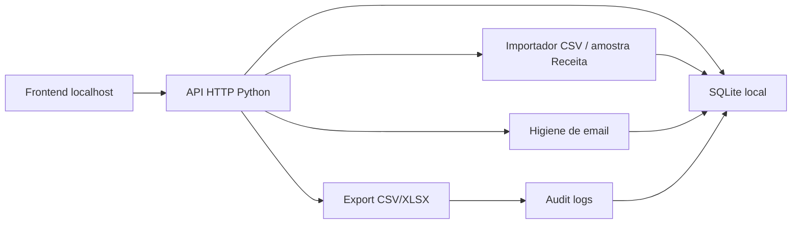

# Radar CNPJ Interno - Arquitetura MVP

## Decisao de stack

Este MVP foi feito para uso interno em localhost. Por isso, a primeira versao usa:

- Python standard library para API HTTP, sem dependencias externas.
- SQLite para persistencia local.
- Frontend estatico em HTML, CSS e JavaScript servido pela propria API.
- Docker opcional para ambiente reproduzivel.

Trade-off: esta stack nao e a ideal para a base nacional completa da Receita Federal. Ela e ideal para validar fluxo, filtros, listas, higiene de email, auditoria e modelo operacional com baixa friccao. A evolucao natural e migrar o banco para PostgreSQL e o importador para staging tables com COPY.

## Diagrama

## Modulos

- `radar_cnpj/database.py`: schema, conexao e bootstrap do workspace interno.
- `radar_cnpj/services.py`: casos de uso principais, busca, listas, importacao, exportacao, auditoria.
- `radar_cnpj/receita_importer.py`: parser MVP para diretorios de amostra no formato Receita.
- `radar_cnpj/official_sources.py`: descoberta WebDAV da fonte oficial, download de ZIPs e consulta BrasilAPI.
- `radar_cnpj/email_hygiene.py`: classificacao de emails, supressao e opt-out.
- `radar_cnpj/email_scoring.py`: score comercial de e-mail com explicacoes.
- `radar_cnpj/company_enrichment.py`: extracao de sinais publicos de site, technology checker e maturidade digital.
- `radar_cnpj/scoring.py`: setor, segmento, score explicavel e estimativa simples.
- `radar_cnpj/exporter.py`: geracao CSV e XLSX sem biblioteca externa.
- `static/*`: interface operacional.

## Modelo de dados

Tabelas principais:

- `organizations`, `users`: base para multi-tenant futuro.
- `companies`, `partners`, `cnaes`, `company_cnaes`: dados publicos de CNPJ.
- `lists`, `list_companies`, `tags`, `company_tags`, `saved_filters`: operacao comercial por workspace.
- `suppression_list`, `opt_outs`, `data_subject_requests`: compliance.
- `email_validations`: historico de higiene de emails.
- `email_classifications`, `email_score_log`, `known_shared_domains`: scoring avancado de e-mail.
- `company_enrichment`, `scraping_jobs`, `scraping_cache`: enriquecimento responsavel e cache.
- `import_jobs`, `export_jobs`, `audit_logs`: rastreabilidade.

## Compliance por design

- Cada empresa guarda `source_name`, `source_url`, `collected_at` e `legal_basis`.
- Exportacao exige finalidade declarada.
- Exportacao gera `export_jobs` e `audit_logs`.
- Emails sao checados contra supressao e opt-out.
- Dados de socio aceitam documento mascarado, nunca CPF completo.
- A lista de supressao deve ser tratada como append-only em producao.

## Evolucao para escala

1. Migrar SQLite para PostgreSQL 16.
2. Criar tabelas de staging para EMPRECSV, ESTABELE, SOCIOCSV, CNAECSV, MUNICCSV.
3. Usar `COPY` para carga bruta e upsert em lotes.
4. Adicionar Redis + BullMQ/Celery para jobs resumiveis.
5. Usar pg_trgm/unaccent no Postgres e, se necessario, Meilisearch ou Typesense.
6. Adicionar autenticacao real, RBAC e hash de senha.
7. Adicionar backups, OpenTelemetry e testes E2E.

## Fontes automatizadas

Fonte primaria:

- Receita Federal / SERPRO public share: `https://arquivos.receitafederal.gov.br/index.php/s/YggdBLfdninEJX9`
- WebDAV publico usado pela aplicacao: `https://arquivos.receitafederal.gov.br/public.php/webdav/`
- Catalogo dados.gov.br: `https://dados.gov.br/dados/conjuntos-dados/cadastro-nacional-da-pessoa-juridica---cnpj`
- Layout oficial: `https://www.gov.br/receitafederal/dados/cnpj-metadados.pdf`

Fonte complementar:

- BrasilAPI CNPJ: `https://brasilapi.com.br/api/cnpj/v1/{cnpj}`

O modo automatico do MVP descobre snapshots mensais, lista arquivos, baixa ZIPs pequenos de dominio e, quando solicitado, baixa um chunk oficial de Empresas/Estabelecimentos/Socios para importacao limitada. A carga nacional completa nao deve rodar em SQLite.
