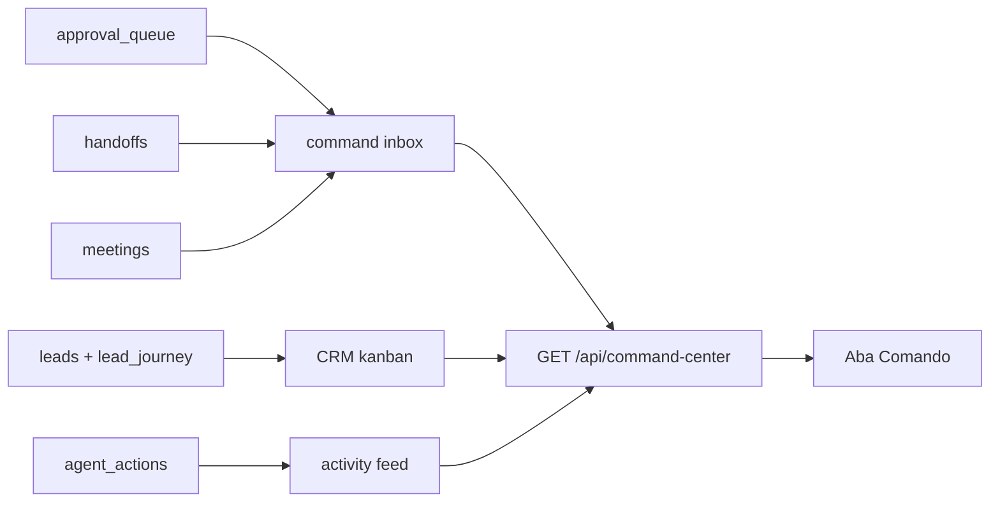

# Fase 09 - Command Center foundation

## Objetivo

Criar a primeira versao do Centro de Comando operacional: uma tela e uma API
que agregam, em um unico lugar, o que precisa de decisao humana, o estado do
pipeline e o feed de atividade auditavel.

Esta fase nao implementa multi-tenancy completo, OKRs ou custo de IA. Ela cria
a base de "glass box" para o operador entender o que esta acontecendo agora sem
ler tabelas de banco.

## Escopo

- Caixa unica de pendencias humanas:
  - aprovacoes de passos de sequencia em `approval_queue`
  - handoffs pendentes em `handoffs`
  - reunioes propostas/agendadas em `meetings`
- Feed de atividade a partir de `agent_actions`.
- Kanban CRM a partir de `leads` e `lead_journey`.
- Metricas operacionais de topo para pendencias e funil.
- Rotulo de origem para cada item agregado.

## Fora do escopo desta fase

- Multi-workspace real.
- Wizard de onboarding.
- OKRs/KPIs editaveis.
- Custo de IA.
- Notificacoes externas.
- Edicao inline de todos os itens do Command Center.

## Decisao central

O Command Center nao deve criar uma segunda fonte de verdade. Ele agrega dados
dos modulos ja existentes, preserva os IDs originais e informa a origem de cada
item. Acoes continuam sendo executadas nos endpoints dos modulos de origem.

## Arquitetura

## Contrato da API

### `GET /api/command-center`

Retorna:

- `metrics`
  - `pending_approvals`
  - `pending_handoffs`
  - `open_meetings`
  - `active_leads`
  - `recent_actions`
- `inbox.items`
  - `source_type`: `approval`, `handoff`, `meeting`
  - `source_id`
  - `priority`
  - `title`
  - `company_name`
  - `email`
  - `status`
  - `reason`
  - `origin_label`
  - `created_at`
  - `context`
- `kanban.columns`
  - `key`
  - `label`
  - `items`
- `activity.items`
  - `id`
  - `action_type`
  - `source`
  - `origin_label`
  - `reason`
  - `lead_email`
  - `company_name`
  - `created_at`

## UI planejada

Nova aba `Comando`:

- Metricas compactas de pendencias.
- Caixa unica de decisao humana.
- Kanban CRM por estado de lead.
- Feed de atividade com origem e motivo.

## Criterios de aceite

- API agrega aprovacoes, handoffs e reunioes sem duplicar dados.
- Cada item da inbox preserva `source_type` e `source_id`.
- Feed mostra origem e motivo das acoes do agente/sistema/humano.
- Kanban mostra leads por estado com contexto minimo de empresa/e-mail.
- UI carrega o Command Center em uma aba propria.
- Testes automatizados cobrem inbox, kanban e feed.
