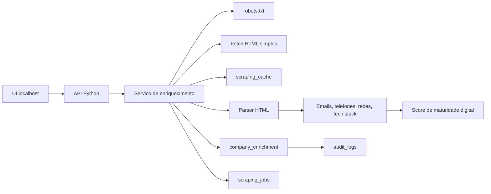

# Fase 02 - Enriquecimento Responsavel de Empresas

Branch: `feature/02-company-enrichment-foundation`

## Meta da fase

Criar a fundacao local para enriquecer empresas a partir de fontes publicas
controladas, sem misturar inferencia com dado oficial da Receita.

Esta fase entrega:

- Modelo persistente para enriquecimento, jobs e cache.
- Extracao de e-mails, telefones, links sociais e tecnologias a partir de HTML.
- Score explicavel de maturidade digital.
- API local para enriquecer uma empresa por HTML informado ou URL explicita.
- Auditoria da acao e registro de origem/timestamp.

Fica fora desta fase:

- Busca automatica em Google/Bing para descobrir dominio.
- Headless browser.
- Raspagem de redes sociais ou fontes com login.
- Envio de e-mail ou criacao automatica de campanha.

## Arquitetura



## Principios

- O CNPJ continua sendo a fonte oficial para dados cadastrais.
- Enriquecimento e inferencia sempre carregam `source_url`, `collected_at`,
  `source_type` e `confidence`.
- O sistema respeita `robots.txt` antes de buscar URL externa.
- Cache evita buscar o mesmo HTML repetidamente durante o TTL.
- Conteudo externo e tratado como dado nao confiavel: o parser extrai sinais,
  mas nao executa script, nao segue formularios e nao acessa area autenticada.
- Falhas de rede ou bloqueio por robots geram job com status de erro claro.

## Modelo de dados

### `company_enrichment`

Guarda o ultimo retrato enriquecido de uma empresa.

- `company_id`: FK para `companies`.
- `source_url`: URL usada como origem.
- `source_type`: `provided_html`, `public_website` ou `manual`.
- `detected_domain`: dominio normalizado da URL.
- `emails_json`: e-mails encontrados no site.
- `phones_json`: telefones encontrados no site.
- `social_links_json`: links sociais encontrados.
- `technologies_json`: tecnologias detectadas.
- `digital_maturity_score`: score 0-100.
- `reasons_json`: explicacao do score.
- `confidence`: `low`, `medium` ou `high`.
- `collected_at`: timestamp de coleta.
- `updated_at`: timestamp de atualizacao.

### `scraping_jobs`

Historico de tentativas.

- `company_id`: empresa alvo.
- `url`: URL solicitada.
- `status`: `queued`, `running`, `completed`, `failed`, `blocked_by_robots`.
- `message`: erro ou resumo operacional.
- `started_at` / `finished_at`: timestamps.

### `scraping_cache`

Cache por URL.

- `url`: URL normalizada.
- `status_code`: status HTTP.
- `headers_json`: headers relevantes.
- `body_hash`: hash SHA-256 do HTML.
- `body_text`: HTML armazenado para reuso local.
- `fetched_at`: quando foi buscado.
- `expires_at`: TTL configurado.

## API inicial

### `POST /api/enrichment/company`

Entrada por HTML:

```json
{
  "company_id": 1,
  "source_url": "https://empresa.com.br",
  "html": "<html>...</html>"
}
```

Entrada por URL:

```json
{
  "company_id": 1,
  "url": "https://empresa.com.br",
  "ttl_days": 30
}
```

Resposta:

```json
{
  "company_id": 1,
  "source_url": "https://empresa.com.br",
  "detected_domain": "empresa.com.br",
  "emails": ["contato@empresa.com.br"],
  "phones": ["11999999999"],
  "social_links": ["https://www.linkedin.com/company/empresa"],
  "technologies": ["wordpress", "google_tag_manager"],
  "digital_maturity_score": 72,
  "reasons": ["Site informado", "E-mail publicado", "Stack de analytics detectado"],
  "confidence": "medium"
}
```

### `GET /api/enrichment/company/{company_id}`

Retorna o ultimo enriquecimento persistido para a empresa.

## Extracoes suportadas

- E-mails publicados em texto ou `mailto:`.
- Telefones BR em formatos comuns, incluindo WhatsApp em links.
- Links sociais: LinkedIn, Instagram, Facebook, YouTube, TikTok, X/Twitter.
- Tecnologia por scripts, metatags, classes comuns e headers.

Tecnologias iniciais:

- `wordpress`
- `woocommerce`
- `shopify`
- `nuvemshop`
- `wix`
- `google_analytics`
- `google_tag_manager`
- `facebook_pixel`
- `rd_station`
- `hotjar`
- `intercom`
- `zendesk`
- `cloudflare`

## Score de maturidade digital

Score 0-100, explicavel:

- Site/URL informado: +15.
- E-mail corporativo publicado: +20.
- Telefone/WhatsApp publicado: +10.
- Link social institucional: +15.
- Ferramenta de analytics/tag manager: +15.
- CMS/e-commerce detectado: +15.
- Chat/atendimento/CRM detectado: +10.

Penalidades:

- Sem e-mail publicado: -10.
- Sem tecnologia detectada: -10.
- Fonte sem URL real: -5.

## Criterios de aceite

- Dado HTML de teste, o parser extrai e-mails, telefones, redes sociais e
  tecnologias esperadas.
- API persiste o enriquecimento em `company_enrichment`.
- URL externa e buscada apenas quando `robots.txt` permite.
- Cache evita nova requisicao quando a URL ainda esta dentro do TTL.
- Resultado mostra origem, timestamp, score e explicacao.
- Testes unitarios cobrem parser, technology checker, score e persistencia.

