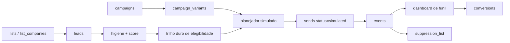

# Fase 03 - CRM de Experimento Comercial em Modo Simulado

Branch: `feature/03-email-experiment-foundation`

## Meta da fase

Criar a fundacao local do mini-CRM de experimento comercial que transforma
listas qualificadas em leads, campanhas e eventos de funil, sem enviar e-mail
real.

Esta fase entrega:

- Modelo de leads, campanhas, variantes, envios simulados, eventos,
  conversoes, throttle e pausas.
- Guardrail de backend que impede envio real no MVP local.
- Criacao de leads a partir de uma lista existente.
- Criacao de campanha com variante A/B inicial.
- Planejamento e simulacao de envios apenas para e-mails elegiveis.
- Eventos e metricas de funil priorizando clique, resposta e conversao.

Fica fora desta fase:

- AWS SES real.
- QStash/Upstash real.
- Webhook SNS real.
- Unsubscribe publico real.
- Configuracao de DNS aplicada em dominio de producao.

## Arquitetura



## Principios

- O MVP local nunca chama provedor de e-mail.
- Toda tentativa de planejamento passa por higiene e supressao.
- E-mail invalido, suprimido, opt-out, descartavel ou pessoal e bloqueado.
- Contato compartilhado/terceirizado pode entrar como lead, mas nao deve ser
  priorizado para envio simulado.
- Abertura e metrica secundaria; o painel prioriza clique, resposta, cadastro,
  demanda e reuniao.
- Eventos simulados ficam marcados como `source = simulated`.

## Modelo de dados

### `leads`

- `id`
- `org_id`
- `company_id`
- `list_id`
- `email`
- `segment`
- `source`
- `score`
- `status`: `new`, `eligible`, `blocked`, `in_campaign`, `responded`,
  `converted`, `opt_out`
- `block_reason`
- `created_at`
- `updated_at`

### `campaigns`

- `id`
- `org_id`
- `name`
- `niche`
- `status`: `draft`, `scheduled`, `running`, `paused`, `completed`
- `subject`
- `body`
- `cta_url`
- `daily_limit`
- `interval_seconds`
- `bounce_pause_threshold`
- `complaint_pause_threshold`
- `mode`: `simulated` no MVP local
- `created_at`
- `updated_at`

### `campaign_variants`

- `id`
- `campaign_id`
- `name`
- `subject`
- `body`
- `cta_url`
- `utm_content`
- `is_active`
- `created_at`

### `sends`

- `id`
- `lead_id`
- `campaign_id`
- `variant_id`
- `email`
- `status`: `planned`, `simulated_sent`, `blocked`, `delivered`, `clicked`,
  `replied`, `converted`, `bounced`, `complained`
- `provider`: `simulated`
- `provider_message_id`
- `block_reason`
- `scheduled_at`
- `sent_at`
- `created_at`

### `events`

- `id`
- `send_id`
- `lead_id`
- `campaign_id`
- `event_type`: `planned`, `sent`, `delivered`, `clicked`, `replied`,
  `converted`, `bounce`, `complaint`, `blocked`
- `source`: `simulated`, `manual`, `ses_sns_future`
- `payload_json`
- `created_at`

### `conversions`

- `id`
- `lead_id`
- `campaign_id`
- `conversion_type`: `signup`, `demand_created`, `meeting`, `reply`
- `utm_json`
- `notes`
- `created_at`

### `throttle_config`

- `id`
- `org_id`
- `daily_limit`
- `interval_seconds`
- `bounce_pause_threshold`
- `complaint_pause_threshold`
- `warmup_day`
- `created_at`
- `updated_at`

### `pause_events`

- `id`
- `campaign_id`
- `pause_type`: `manual`, `automatic`
- `reason`
- `created_at`

## Guardrails de elegibilidade

Funcao planejada: `assess_lead_eligibility(conn, lead)`.

Bloqueia se:

- E-mail vazio ou invalido.
- E-mail esta em `suppression_list` ou `opt_outs`.
- Higiene retorna `Invalido`, `Suprimido`, `Opt-out` ou `Suspeito`.
- Scoring avancado tem labels `disposable`, `suppressed`, `invalid`,
  `personal_domain`, `shared_contact` ou `known_shared_domain`.
- Score comercial de e-mail menor que 30.
- Lead ja possui envio ativo na mesma campanha.

Permite se:

- E-mail passa higiene.
- Nao esta suprimido.
- Score comercial de e-mail e pelo menos 30.
- Lead ainda nao esta em envio ativo da campanha.

## UTM

Todo CTA simulado recebe:

- `utm_campaign`: slug da campanha.
- `utm_content`: variante.
- `utm_source`: nicho/segmento.
- `utm_medium`: `email_simulated`.

## Plano futuro de DNS e SES

Dominio de envio recomendado:

- Subdominio: `mail.usevagou.com.br`
- From tecnico: `contato@mail.usevagou.com.br`
- Return-path: `bounce@mail.usevagou.com.br`

Registros esperados, ajustados com os valores reais do SES:

```text
mail.usevagou.com.br TXT "v=spf1 include:amazonses.com -all"
_dmarc.mail.usevagou.com.br TXT "v=DMARC1; p=quarantine; rua=mailto:dmarc@usevagou.com.br; fo=1"
<token1>._domainkey.mail.usevagou.com.br CNAME <token1>.dkim.amazonses.com
<token2>._domainkey.mail.usevagou.com.br CNAME <token2>.dkim.amazonses.com
<token3>._domainkey.mail.usevagou.com.br CNAME <token3>.dkim.amazonses.com
bounce.mail.usevagou.com.br MX 10 feedback-smtp.<region>.amazonses.com
```

Thresholds de pausa futura:

- Bounce preventivo: 2%.
- Complaint preventivo: 0.05%.
- Nunca continuar campanha acima destes thresholds sem revisao humana.

Warm-up futuro:

- Dia 1: ate 50 destinatarios unicos.
- Dia 2: ate 100.
- Dia 3: ate 200.
- Dias seguintes: aumento gradual se bounce/complaint permanecerem abaixo dos
  thresholds preventivos.

## API inicial

### `POST /api/experiments/leads/from-list`

Cria ou atualiza leads a partir de uma lista existente.

```json
{
  "list_id": 1,
  "source": "lista qualificada"
}
```

### `GET /api/experiments/leads`

Lista leads do workspace.

### `POST /api/experiments/campaigns`

Cria campanha em modo `simulated`.

```json
{
  "name": "Teste padarias SP",
  "niche": "Padarias SP",
  "subject": "Ideia rapida para {{nome_empresa}}",
  "body": "Texto da abordagem...",
  "cta_url": "https://usevagou.com.br/contato"
}
```

### `GET /api/experiments/campaigns`

Lista campanhas com funil agregado.

### `POST /api/experiments/campaigns/{id}/simulate`

Planeja e marca envios simulados para leads elegiveis.

```json
{
  "list_id": 1,
  "limit": 25
}
```

### `POST /api/experiments/events`

Registra evento manual/simulado de funil.

```json
{
  "send_id": 1,
  "event_type": "clicked"
}
```

## Criterios de aceite

- Leads sao criados a partir de lista sem duplicar e-mail/empresa.
- Leads sem e-mail valido sao bloqueados com motivo claro.
- E-mail em supressao nunca gera `simulated_sent`.
- Campanha criada sempre nasce em `mode = simulated`.
- Simulacao cria `sends` e `events`, mas nao chama provedor externo.
- Funil de campanha mostra enviados, entregues, cliques, respostas,
  conversoes, bounces e complaints.
- Testes automatizados cobrem elegibilidade, supressao, criacao de campanha,
  simulacao e funil.

