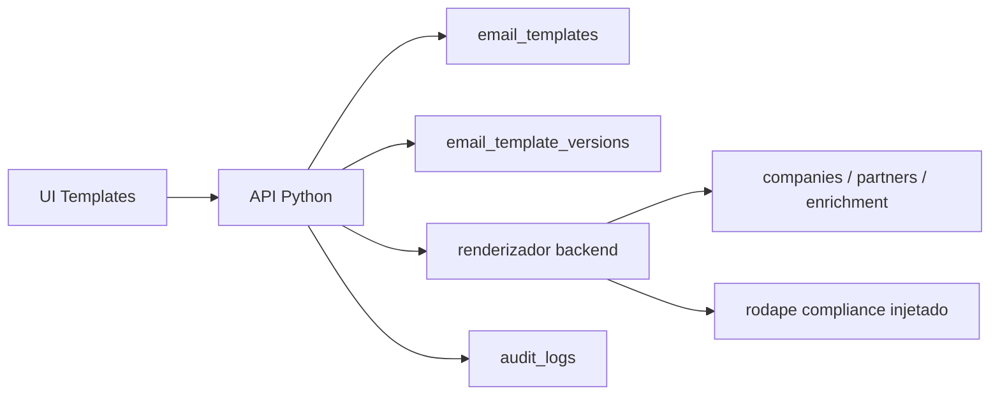

# Fase 04 - Templates de E-mail Versionados

Branch: `feature/04-email-template-foundation`

## Meta da fase

Criar um criador de templates reutilizaveis para campanhas e cadencias, com
variaveis renderizadas pelo backend, versionamento imutavel e rodape de
compliance injetado pelo sistema.

Esta fase entrega:

- Modelo `email_templates` e `email_template_versions`.
- Renderizador de assunto/corpo com variaveis permitidas.
- Preview com dados reais de uma empresa.
- Criacao de nova versao sem sobrescrever versoes antigas.
- Rodape de compliance obrigatorio, nao editavel pelo usuario.
- API e UI local para criar, listar, versionar e testar templates.

Fica fora desta fase:

- Envio real.
- Editor visual rich-text.
- Biblioteca multi-workspace de playbooks.
- A/B automatico a partir de template.

## Arquitetura



## Principios

- O usuario edita assunto e corpo, mas nao edita rodape de compliance.
- Cada mudanca relevante cria uma nova versao.
- Campanhas futuras devem referenciar `template_version_id`, nao texto solto.
- Renderizacao e feita no backend para nao confiar na UI.
- Variavel desconhecida nao quebra o template; ela aparece em `missing_variables`.
- Template renderizado deve indicar origem do dado usado.

## Variaveis suportadas

- `{{nome_empresa}}`: nome fantasia ou razao social.
- `{{razao_social}}`: razao social.
- `{{cnpj}}`: CNPJ formatado.
- `{{cidade}}`: cidade.
- `{{estado}}`: UF.
- `{{cnae_codigo}}`: CNAE principal.
- `{{cnae_descricao}}`: descricao do CNAE principal.
- `{{setor}}`: setor inferido.
- `{{segmento}}`: segmento inferido.
- `{{nome_contato}}`: primeiro socio/administrador importado, quando existir.
- `{{email_empresa}}`: e-mail cadastral da empresa.
- `{{motivo_contato}}`: motivo calculado a partir de CNAE, cidade e fonte.
- `{{cta_url}}`: CTA informado no preview ou campanha.

## Rodape de compliance

O rodape e anexado pelo backend em toda renderizacao:

```text

--
Voce recebeu este contato em contexto B2B, a partir de dados publicos de CNPJ
e/ou canais publicados pela propria empresa. Para nao receber novos contatos,
responda "remover" ou acesse {{unsubscribe_url}}. Politica de privacidade:
{{privacy_url}}.
```

Regras:

- O corpo salvo pelo usuario nao pode conter `{{unsubscribe_url}}` nem
  `{{privacy_url}}`; estes valores pertencem ao sistema.
- O rodape aparece apenas na renderizacao, nao dentro do corpo editavel.
- `unsubscribe_url` e `privacy_url` tem defaults locais, mas podem ser
  substituidos no payload de preview.

## Modelo de dados

### `email_templates`

- `id`
- `org_id`
- `name`
- `purpose`: `first_contact`, `follow_up`, `final_follow_up`,
  `reply_to_question`, `other`
- `status`: `active` ou `archived`
- `created_at`
- `updated_at`

### `email_template_versions`

- `id`
- `template_id`
- `version_number`
- `subject`
- `body`
- `variables_json`
- `compliance_footer`
- `is_active`
- `created_at`

## API inicial

### `POST /api/templates`

Cria template e versao 1.

```json
{
  "name": "Primeiro contato B2B",
  "purpose": "first_contact",
  "subject": "Ideia rapida para {{nome_empresa}}",
  "body": "Vi que a {{nome_empresa}} atua em {{cidade}}..."
}
```

### `GET /api/templates`

Lista templates com versao ativa.

### `GET /api/templates/{id}`

Retorna template, versoes e versao ativa.

### `POST /api/templates/{id}/versions`

Cria uma nova versao e marca como ativa.

### `POST /api/templates/render`

Renderiza por `template_id` ou `template_version_id`.

```json
{
  "template_id": 1,
  "company_id": 1,
  "cta_url": "https://usevagou.com.br/contato"
}
```

## Criterios de aceite

- Criar template gera versao 1 ativa.
- Criar nova versao nao sobrescreve versao anterior.
- Renderizacao substitui variaveis conhecidas com dado real da empresa.
- Variaveis desconhecidas aparecem em `missing_variables`.
- Rodape de compliance e sempre injetado no corpo renderizado.
- Usuario nao consegue salvar `{{unsubscribe_url}}` ou `{{privacy_url}}` no
  corpo editavel.
- Testes automatizados cobrem criacao, versionamento, renderizacao e rodape.

