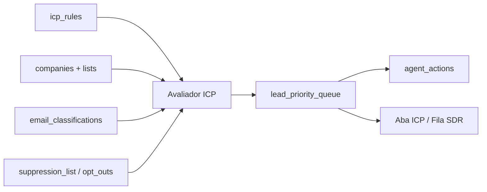

# Fase 06 - ICP estruturado e priorizacao SDR

## Objetivo

Criar a fundacao para o agente SDR selecionar leads sem depender de julgamento
livre do modelo. O ICP passa a viver como regra estruturada no banco, e a fila
SDR mostra apenas empresas/leads que respeitam esse ICP.

Esta fase ainda nao executa envio autonomo. Ela prepara a selecao, priorizacao
e explicacao do motivo de cada lead entrar na fila.

## Fora do escopo desta fase

- Envio real por SES.
- Classificacao de respostas recebidas.
- Reunioes, handoff automatico e agenda.
- Alteracao automatica de ICP pelo agente.
- Multi-workspace completo.

## Decisao central

O agente pode priorizar dentro do conjunto elegivel, mas nao define o conjunto
elegivel. O backend aplica os filtros do ICP antes de qualquer fila SDR.

## Modelo de arquitetura

## Modelo de dados

### `icp_rules`

- `id`
- `org_id`
- `name`
- `description`
- `status`: `draft`, `active`, `archived`
- `criteria_json`: regra estruturada em JSON
- `created_at`
- `updated_at`

Campos aceitos em `criteria_json` nesta fase:

- `states`: lista de UFs aceitas.
- `cities`: lista de cidades aceitas.
- `cnaes`: lista de CNAEs principais aceitos por prefixo ou codigo completo.
- `sectors`: setores inferidos aceitos.
- `sizes`: portes aceitos.
- `min_opportunity_score`: score minimo da empresa.
- `min_email_score`: score minimo do e-mail.
- `require_email`: exige e-mail cadastral.
- `require_corporate_email`: bloqueia dominios pessoais.
- `exclude_shared_email`: bloqueia contato compartilhado/terceirizado.
- `exclude_suppressed`: bloqueia e-mails em supressao/opt-out.
- `max_leads`: limite de sugestoes por execucao.

### `lead_priority_queue`

- `id`
- `org_id`
- `icp_rule_id`
- `lead_id`
- `company_id`
- `list_id`
- `status`: `suggested`, `accepted`, `rejected`, `enrolled`, `stale`
- `priority_score`
- `fit_score`
- `reason_json`
- `created_at`
- `updated_at`

Restricao: um mesmo lead/empresa nao deve aparecer duplicado como `suggested`
para a mesma regra.

## Algoritmo de fit

1. Buscar empresas de uma lista ou da base inteira.
2. Exigir regra minima:
   - status cadastral ativo quando disponivel.
   - e-mail se `require_email = true`.
   - supressao/opt-out ausente se `exclude_suppressed = true`.
3. Aplicar filtros estruturados:
   - UF, cidade, CNAE, setor, porte.
   - score minimo da empresa.
   - score minimo de e-mail.
   - e-mail corporativo se exigido.
   - contato compartilhado/terceirizado se bloqueado.
4. Calcular `fit_score` a partir de criterios batidos.
5. Calcular `priority_score` combinando:
   - score da empresa.
   - score de e-mail.
   - fit do ICP.
   - bonus de maturidade digital quando houver enriquecimento.
6. Persistir a fila com explicacoes auditaveis.

## Guardrails

- ICP e dado estruturado, nao prompt livre.
- Fila SDR nunca inclui e-mail suprimido quando `exclude_suppressed` esta ativo.
- Leads bloqueados pela higiene ou pelo score minimo nao entram como
  `suggested`.
- Toda execucao registra `agent_actions` com contagem de sugeridos e bloqueados.
- Aceitar ou rejeitar sugestao registra nota e muda status, sem enviar nada.

## API planejada

- `POST /api/icp-rules`
- `GET /api/icp-rules`
- `GET /api/icp-rules/{id}`
- `POST /api/icp-rules/{id}/prioritize`
- `GET /api/priority-queue`
- `POST /api/priority-queue/{id}/accept`
- `POST /api/priority-queue/{id}/reject`

## UI planejada

Nova aba `ICP SDR`:

- Formulario compacto para criar regra.
- Seletor de lista opcional para priorizar uma lista qualificada.
- Tabela de regras ICP.
- Fila SDR priorizada com score, empresa, email e motivos.
- Acoes `Aceitar` e `Rejeitar` com nota.

## Criterios de aceite

- Regra ICP persiste criterios estruturados e pode ser listada.
- Priorizacao retorna apenas empresas/leads que batem os filtros obrigatorios.
- E-mail suprimido nao entra na fila quando `exclude_suppressed = true`.
- E-mail abaixo de `min_email_score` nao entra na fila.
- Cada sugestao mostra explicacao do score e dos criterios batidos.
- Aceitar/rejeitar sugestao muda status e registra `agent_actions`.
- Testes automatizados cobrem fit, bloqueios e fila.
- Smoke HTTP cria regra, prioriza lista e decide uma sugestao.
