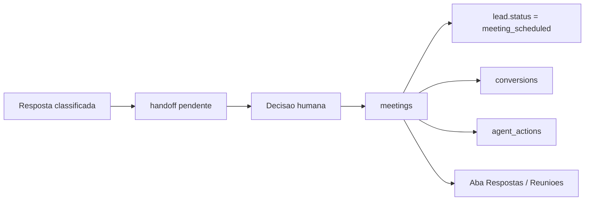

# Fase 08 - Reunioes e agenda operacional

## Objetivo

Criar a fundacao local para transformar um handoff humano em registro
operacional de reuniao, mantendo o fluxo semi-supervisionado e sem fingir uma
integracao real de calendario ou envio de convite.

A fase fecha o ciclo iniciado em `Respostas`: uma resposta de interesse cria
handoff, o humano assume, registra a reuniao e o sistema atualiza lead,
auditoria e funil.

## Fora do escopo desta fase

- Integracao real com Google Calendar, Outlook, Cal.com ou WhatsApp.
- Envio automatico de convite ou link ao lead.
- Leitura de disponibilidade de agenda.
- Agendamento autonomo pelo agente.
- Sincronizacao bidirecional de status com provedores externos.

## Decisao central

Reuniao e uma acao comercial confirmada ou proposta por humano. O sistema pode
registrar, auditar e atualizar estados, mas nao deve interpretar uma resposta
externa como autorizacao automatica para marcar compromisso.

## Arquitetura

## Modelo de dados

### `meetings`

- `id`
- `org_id`
- `lead_id`
- `company_id`
- `reply_classification_id`
- `handoff_id`
- `status`: `proposed`, `scheduled`, `completed`, `cancelled`, `no_show`
- `title`
- `attendee_email`
- `scheduled_at`
- `duration_minutes`
- `meeting_url`
- `owner_name`
- `notes`
- `outcome_note`
- `source`
- `created_at`
- `updated_at`

## Regras

- Meeting sempre pertence a um `lead_id`.
- Meeting nao pode ser criada para lead em `opt_out` ou e-mail suprimido.
- Criar meeting a partir de handoff pendente atualiza o handoff para
  `resolved` com nota operacional.
- Criar meeting atualiza o lead para `meeting_scheduled`.
- Criar meeting registra conversao `meeting_scheduled`.
- Atualizar status para `completed` muda o lead para `qualified`.
- Atualizar status para `cancelled` ou `no_show` deixa o lead em
  `meeting_review`.
- Toda criacao ou atualizacao registra `agent_actions` com origem humana.

## API planejada

- `POST /api/handoffs/{id}/meeting`
- `POST /api/meetings`
- `GET /api/meetings`
- `POST /api/meetings/{id}/status`

## UI planejada

Na aba `Respostas`:

- Formulario para criar reuniao a partir de handoff.
- Tabela de reunioes recentes.
- Acao rapida nos handoffs pendentes para preencher o ID do handoff.
- Atualizacao de status da reuniao com nota.

## Criterios de aceite

- Criar reuniao por handoff pendente resolve o handoff e atualiza lead.
- Criar reuniao bloqueia lead em opt-out ou e-mail suprimido.
- Criar reuniao registra conversao `meeting_scheduled`.
- Atualizar status registra `agent_actions` e atualiza lead conforme regra.
- API lista reunioes com contexto da empresa e do lead.
- UI permite criar e revisar reunioes sem sair da aba `Respostas`.
- Testes automatizados cobrem criacao, bloqueio por opt-out e atualizacao de
  status.
