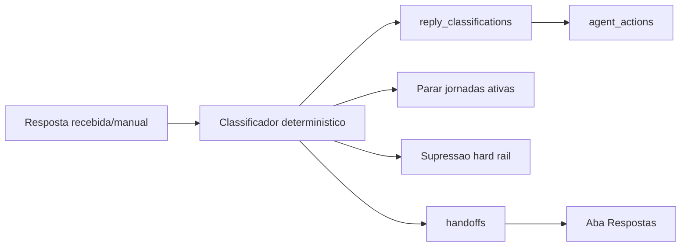

# Fase 07 - Classificacao de respostas e handoff humano

## Objetivo

Criar a fundacao local para receber uma resposta de e-mail, classificar a
intencao em categorias fixas, parar a cadencia quando necessario e criar
handoff humano para casos que exigem julgamento.

Esta fase ainda nao configura SES Receiving nem processa e-mail real. Ela
implementa o contrato de dados, API e UI local para simular esse fluxo com os
mesmos trilhos de compliance.

## Fora do escopo desta fase

- SES Receiving real.
- Validacao de assinatura SNS.
- Resposta automatica ao lead.
- Agendamento real de reuniao.
- LLM em producao para classificacao.

## Categorias fixas

- `interest_meeting`: interesse claro ou pedido de conversa.
- `question`: duvida ou pedido de mais informacoes.
- `not_interested`: recusa clara sem pedido de remocao.
- `opt_out`: pedido de remocao, descadastro ou parar contato.
- `out_of_office`: ausencia/autoresposta.
- `wrong_person`: pessoa errada ou pedido para falar com outro contato.
- `ambiguous`: caso sem confianca suficiente.

## Decisao central

Conteudo de resposta recebida e dado externo nao confiavel. Ele nunca vira
instrucao de sistema. O classificador so extrai intencao em categoria fixa e
aciona funcoes de backend com guardrails.

## Arquitetura

## Modelo de dados

### `reply_classifications`

- `id`
- `org_id`
- `lead_id`
- `send_id`
- `email`
- `subject`
- `body_text`
- `classification`
- `confidence`
- `reasons_json`
- `raw_payload_json`
- `created_at`

### `handoffs`

- `id`
- `org_id`
- `lead_id`
- `reply_classification_id`
- `status`: `pending`, `resolved`, `dismissed`
- `priority`: `low`, `medium`, `high`, `urgent`
- `reason`
- `context_json`
- `created_at`
- `resolved_at`
- `resolution_note`

## Regras de acao

- `opt_out`
  - adiciona `email` a `suppression_list` imediatamente.
  - atualiza lead para `opt_out`.
  - para jornadas ativas como `opt_out`.
  - cria handoff de prioridade `urgent` para visibilidade humana.
- `interest_meeting`
  - atualiza lead para `replied`.
  - para jornadas ativas como `responded`.
  - cria handoff `high`.
- `question`
  - atualiza lead para `replied`.
  - para jornadas ativas como `responded`.
  - cria handoff `medium`.
- `wrong_person`
  - atualiza lead para `replied`.
  - para jornadas ativas como `responded`.
  - cria handoff `medium`.
- `ambiguous`
  - atualiza lead para `replied`.
  - para jornadas ativas como `responded`.
  - cria handoff `high`.
- `not_interested`
  - atualiza lead para `disqualified`.
  - para jornadas ativas como `disqualified`.
  - nao cria handoff por padrao.
- `out_of_office`
  - atualiza lead para `waiting_reply_review`.
  - para jornadas ativas como `paused_reply`.
  - cria handoff `low`.

## API planejada

- `POST /api/replies/classify`
- `GET /api/replies`
- `GET /api/handoffs`
- `POST /api/handoffs/{id}/resolve`
- `POST /api/handoffs/{id}/dismiss`

## UI planejada

Nova aba `Respostas`:

- Formulario para simular resposta recebida por `send_id`, `lead_id` ou e-mail.
- Tabela de classificacoes.
- Tabela de handoffs pendentes.
- Acao para resolver ou dispensar handoff com nota.

## Criterios de aceite

- Opt-out em variacoes comuns cria supressao imediata.
- Opt-out para a jornada e atualiza lead.
- Interesse claro cria handoff de alta prioridade.
- Resposta ambigua cria handoff, nunca acao silenciosa.
- Recusa clara encerra jornada sem criar novo envio.
- Toda classificacao e toda acao relevante geram `agent_actions`.
- Testes automatizados cobrem opt-out, interesse, ambiguidade e handoff.
- Smoke HTTP registra uma resposta e resolve um handoff.
