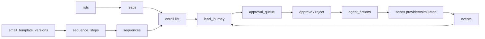

# Fase 05 - Sequencias Semi-Supervisionadas

Branch: `feature/05-sequence-supervision-foundation`

## Meta da fase

Criar a fundacao de cadencias de outbound semi-supervisionadas, conectando
leads, templates e campanhas simuladas por meio de uma fila de aprovacao
humana. Nenhum passo envia e-mail real.

Esta fase entrega:

- Modelo `sequences`, `sequence_steps`, `lead_journey`, `approval_queue` e
  `agent_actions`.
- Criacao de sequencia com passos baseados em templates versionados.
- Inscricao de leads de uma lista em uma sequencia.
- Geracao de aprovacao humana para o proximo passo.
- Aprovacao/rejeicao de um passo.
- Execucao simulada do passo aprovado, reutilizando os trilhos de campanha
  simulada ja existentes.
- Log explicavel de cada acao.

Fica fora desta fase:

- Agente LLM autonomo.
- Cron real.
- Envio real.
- Classificacao de respostas recebidas por e-mail real.
- Avanco automatico sem aprovacao.

## Arquitetura



## Principios

- Todo passo inicial exige aprovacao humana.
- O sistema pode sugerir proximo passo, mas nao executa sem aprovacao.
- Conteudo enviado e renderizado no backend a partir de uma versao de template.
- A aprovacao registra contexto, motivo e snapshot do texto renderizado.
- O envio continua simulado e passa pelos guardrails de lead/campanha ja
  implementados.
- Qualquer rejeicao encerra ou pausa a jornada daquele lead, conforme motivo.
- Cada decisao vira `agent_actions`, preparando a futura camada de agente SDR e
  command center.

## Modelo de dados

### `sequences`

- `id`
- `org_id`
- `name`
- `description`
- `status`: `draft`, `active`, `paused`, `archived`
- `created_at`
- `updated_at`

### `sequence_steps`

- `id`
- `sequence_id`
- `step_number`
- `name`
- `step_type`: `email`
- `wait_days`
- `template_id`
- `template_version_id`
- `require_approval`
- `created_at`

### `lead_journey`

- `id`
- `org_id`
- `lead_id`
- `sequence_id`
- `current_step_id`
- `current_step_number`
- `status`: `pending_approval`, `approved`, `simulated_sent`, `waiting`,
  `completed`, `rejected`, `blocked`
- `next_action_at`
- `last_action_at`
- `block_reason`
- `created_at`
- `updated_at`

### `approval_queue`

- `id`
- `org_id`
- `item_type`: `sequence_step`
- `item_id`: `lead_journey.id`
- `status`: `pending`, `approved`, `rejected`
- `title`
- `context_json`
- `created_at`
- `decided_at`
- `decision_note`

### `agent_actions`

- `id`
- `org_id`
- `lead_id`
- `sequence_id`
- `action_type`
- `source`: `system`, `human`, `agent_future`
- `reason`
- `payload_json`
- `created_at`

## Fluxo

1. Operador cria sequencia com um ou mais passos.
2. Operador inscreve uma lista na sequencia.
3. Sistema cria/atualiza leads da lista e cria `lead_journey` para os leads
   elegiveis.
4. Sistema renderiza o primeiro template para cada lead e cria item em
   `approval_queue`.
5. Operador aprova ou rejeita.
6. Se aprovado, sistema cria campanha simulada tecnica se necessario, cria
   `sends` e `events`, e atualiza a jornada.
7. Se houver proximo passo, jornada fica `waiting` com `next_action_at`.
8. Nesta fase, avanco de passo futuro e manual/supervisionado.

## API inicial

### `POST /api/sequences`

```json
{
  "name": "Cadencia inicial B2B",
  "description": "Primeiro contato e follow-up",
  "steps": [
    {"name": "Primeiro contato", "template_id": 1, "wait_days": 0},
    {"name": "Follow-up curto", "template_id": 2, "wait_days": 3}
  ]
}
```

### `GET /api/sequences`

Lista sequencias com passos.

### `POST /api/sequences/{id}/enroll`

```json
{
  "list_id": 1
}
```

### `GET /api/sequences/journeys`

Lista jornadas.

### `GET /api/approvals`

Lista aprovacoes pendentes.

### `POST /api/approvals/{id}/approve`

Aprova e executa o passo em modo simulado.

### `POST /api/approvals/{id}/reject`

Rejeita e registra motivo.

## Criterios de aceite

- Criar sequencia exige ao menos um passo com template versionado valido.
- Inscrever lista cria jornadas apenas para leads elegiveis.
- Cada jornada gera aprovacao pendente com assunto/corpo renderizado.
- Aprovar cria envio simulado e evento `sent`.
- Rejeitar nao cria envio.
- Cada aprovacao/rejeicao gera `agent_actions` auditavel.
- Nenhum endpoint chama provedor externo.
- Testes automatizados cobrem criacao, inscricao, aprovacao, rejeicao e logs.

